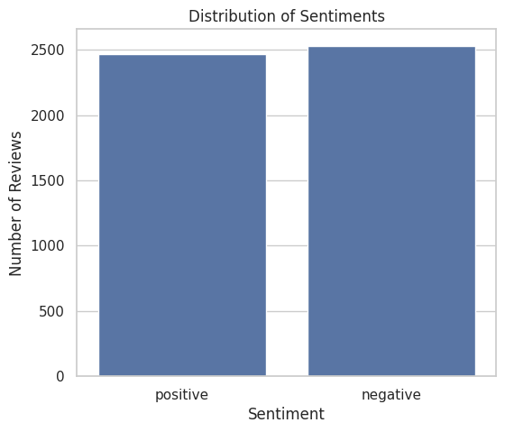
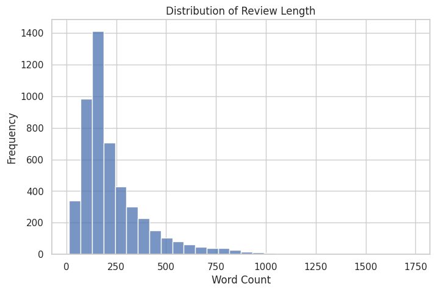
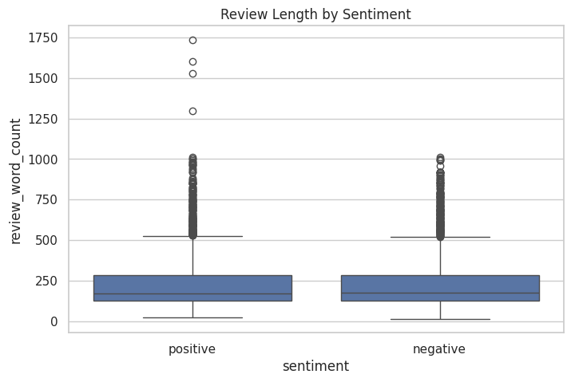
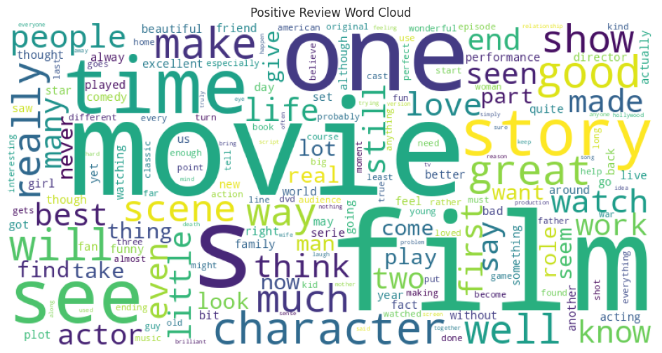
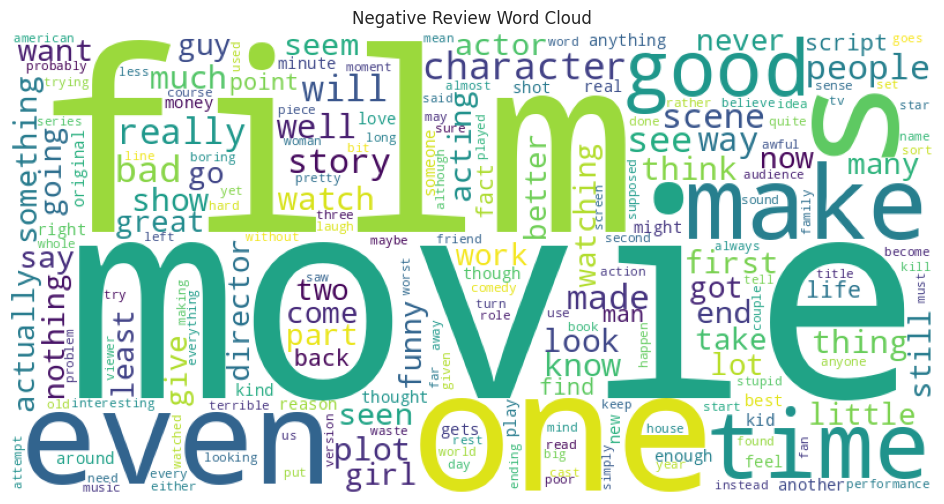
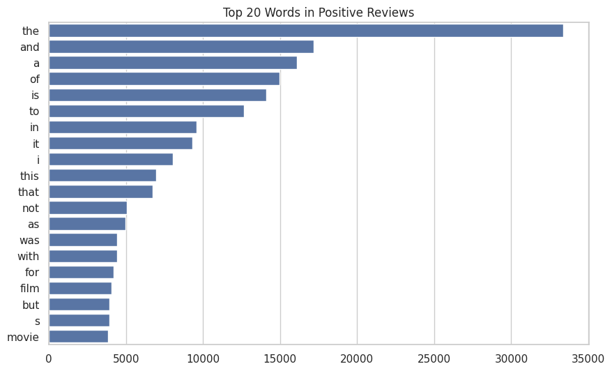
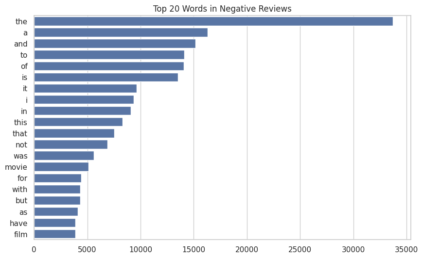

# IMDB Movie Reviews - Sentiment Analysis

## Project Overview

This project performs sentiment analysis on IMDB movie reviews using Python and Natural Language Processing (NLP). The analysis classifies reviews into positive and negative sentiments and visualizes text patterns using charts and word clouds.

## Tools Used

- Python
- Pandas
- NumPy
- Matplotlib
- Seaborn
- WordCloud

## Features

- Sentiment Distribution Analysis
- Review Length Analysis
- Word Cloud Visualization
- Word Frequency Analysis
- Insight Generation

## Installation

```bash
pip install -r requirements.txt
```

## Usage

Open the notebook in Jupyter Notebook or Google Colab and run all cells sequentially.

## Dataset

IMDB Movie Reviews Dataset (Preprocessed)

## Sample Visualizations

### Sentiment Distribution



### Review Length Distribution



### Review Length by Sentiment



### Positive Word Cloud



### Negative Word Cloud



### Top 20 Positive Words



### Top 20 Negative Words


